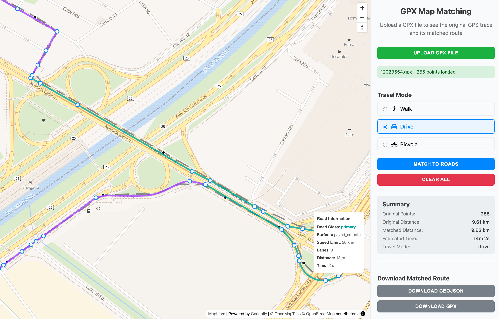

# GPX Map Matching (Snap to Roads) with Geoapify & MapLibre GL

This demo shows how to take GPS track data from a GPX file and snap it to the road network using the 
[Geoapify Map Matching API](https://www.geoapify.com/map-matching-api/). 
The original GPS trace and the matched route are displayed on an interactive map powered by MapLibre GL, 
with travel mode selection, route summary, and download options.

## Features

- Upload a GPX file and visualize its raw GPS trace  
- Snap the GPS trace to the road network using the [Geoapify Map Matching API](https://www.geoapify.com/map-matching-api/)  
- Choose travel mode (walking, driving, cycling)  
- View road attributes such as road class, surface, speed limit, and lanes  
- Compare original and matched route distance and time  
- Download matched routes as **GeoJSON** or **GPX**



## Demo

Run the standalone demo from GitHub Pages:  
**[Open Demo](https://geoapify.github.io/maps-api-code-samples/javascript/map-matching-to-snap-gpx-to-roads-maplibre/demo_combined.html)**

## APIs and Libraries Used

- [Geoapify Map Matching API](https://www.geoapify.com/map-matching-api/) – snaps raw GPS traces to the road network  
- [MapLibre GL JS](https://maplibre.org/) – renders the interactive vector map  
- [toGeoJSON](https://github.com/mapbox/togeojson) – converts GPX to GeoJSON format  
- [togpx](https://www.npmjs.com/package/togpx) – converts GeoJSON to GPX format  
- [Simplify.js](https://mourner.github.io/simplify-js/) – reduces the number of GPS points for optimal performance  
- [Font Awesome](https://fontawesome.com/) – icons for the UI

## How to Run the Sample

You can run the demo locally or deploy it using GitHub Pages.

### Option 1: Run Locally with Static Server

1. **Install `http-server`** (if not installed globally):

```bash
npm install -g http-server
```

2. **Start the server** from the `src` folder:

```bash
http-server ./src
```

3. **Open the app** in your browser:

```
http://localhost:8080/demo.html
```

### Option 2: Use IDE Live Preview

If you use VS Code, WebStorm, or another IDE with live server support:

* **VS Code:** Install "Live Server" extension → Right-click `demo.html` → "Open with Live Server"
* **WebStorm / IntelliJ:** Right-click file → "Open in browser"

> Do not open via `file://` path as it blocks dynamic imports and module loading.

## How to Build `demo_combined.html`

To create a standalone HTML file (ideal for GitHub Pages or email demos):

1. **Navigate to the root folder** (e.g., `javascript/map-matching-to-snap-gpx-to-roads-maplibre/`):

```bash
cd javascript
```

2. **Install `inline-source`** (once):

```bash
npm install inline-source
```

3. **Run the combine script:**

```bash
node map-matching-to-snap-gpx-to-roads-maplibre/combine.js
```

This will create a `demo_combined.html` with all scripts and styles inlined.

## Code Highlights

### 1. Loading a GPX File

When a user selects a .gpx file, the app uses the FileReader API to read it as plain text.
This text contains XML data describing GPS tracks. Once loaded, the content is passed to a custom parsing function.

```javascript
const reader = new FileReader();
reader.onload = (e) => {
  // GPX file content as text
  const gpxContent = e.target.result;

  // Convert GPX → GeoJSON and extract track points
  const result = fileUtils.parseGpxFile(gpxContent);

  // ...
};
reader.readAsText(file);
```

The `parseGpxFile()` helper method converts GPX XML into the widely used GeoJSON format using the toGeoJSON library:

```javascript
parseGpxFile(gpxContent) {
    // Parse GPX XML content
    const parser = new DOMParser();
    const xmlDoc = parser.parseFromString(gpxContent, 'application/xml');
    
    // Convert GPX → GeoJSON
    const geoJson = toGeoJSON.gpx(xmlDoc);
    
    // Normalize and optionally simplify
    // ...
}
```

**Key steps:**
1. Read the GPX file as text using `FileReader`.
2. Parse XML into a DOM structure with `DOMParser`.
3. Convert to GeoJSON using `toGeoJSON.gpx()`, which extracts track segments and points.
4. Normalize track points into an array with coordinates and timestamps (if available).
5. (Optional) simplify the result for optimal performance.


### 2. Simplifying the GPX Track

GPX tracks can contain thousands of points, which can slow down processing and visualization.
The demo uses [Simplify.js](https://mourner.github.io/simplify-js/) to reduce the number of points to a maximum of **1000** – the limit supported by the public [Geoapify Map Matching API](https://www.geoapify.com/map-matching-api/).

```javascript
if (coordinates.length > MAX_POINTS /* 1000 */) {
  const result = this.simplifyPolyline(coordinates, timestamps, MAX_POINTS);
  coordinates = result.coordinates;
  timestamps = result.timestamps;
  console.log(`Route simplified to ${coordinates.length} points`);
}
```

**Key steps:**
1. **Check track size** – If there are more than `MAX_POINTS` points (default: 1000), simplification is applied.
2. **Run polyline simplification** – `simplifyPolyline()` uses a tolerance-based algorithm to remove points that do not significantly affect the overall geometry.
3. **Preserve timestamps** – The algorithm keeps time data aligned with the remaining points when available.
4. **Result** – A simplified track that still represents the original shape but is fast enough to send to the Map Matching API (which only supports 1000 points).

### 3. Sending a Request to the Map Matching API

Once the GPS track is simplified (if needed), the points are sent to the
[Geoapify Map Matching API](https://www.geoapify.com/map-matching-api/) to “snap” them to the road network.
The request includes the travel mode and an array of waypoints with coordinates and optional timestamps.

```javascript
const requestData = {
  mode: travelMode, // "walk", "drive", "bicycle"
  waypoints: gpxData.map(point => ({
    location: point.location,
    timestamp: point.timestamp
  }))
};

const response = await fetch(
  `https://api.geoapify.com/v1/mapmatching?apiKey=${API_KEY}`,
  {
    method: 'POST',
    headers: { 'Content-Type': 'application/json' },
    body: JSON.stringify(requestData)
  }
);

const matchingResult = await response.json();
```

**Key steps:**

1. **Prepare request payload** – Includes the travel mode and simplified list of track points.
2. **Call Map Matching API** – Sends a POST request with JSON payload.
3. **Receive snapped route** – Returns a [GeoJSON](https://geojson.org/) `FeatureCollection` containing the matched geometry and road attributes such as `road_class`, `surface`, `speed_limit`, etc.
4. **Handle errors** – Checks response status and throws an error if the request fails or returns no features.

### 4. Visualizing the Result on the Map

The demo shows **both** the original GPS trace and the snapped (matched) route on an interactive
[MapLibre GL](https://maplibre.org/) map.
The original trace is displayed as a dashed gray line, while the matched route is drawn in blue.
Hover popups show road attributes such as `road_class`, `surface`, and `speed_limit`.

```javascript
// Original GPS trace
map.addSource('gps-trace', {
  type: 'geojson',
  data: {
    type: 'FeatureCollection',
    features: [{
      type: 'Feature',
      geometry: { type: 'LineString', coordinates },
      properties: {}
    }]
  }
});

map.addLayer({
  id: 'gps-trace-line',
  type: 'line',
  source: 'gps-trace',
  paint: {
    'line-color': '#666',
    'line-width': 4,
    'line-dasharray': [10, 5]
  }
});

// Matched route from API
map.addSource('matched-trace', {
  type: 'geojson',
  data: matchingResult
});

map.addLayer({
  id: 'matched-trace-line',
  type: 'line',
  source: 'matched-trace',
  paint: {
    'line-color': '#007bff',
    'line-width': 5
  }
});
```

**Key steps:**

1. **Add original trace source and layer** – Visualize uploaded GPS track as a dashed gray line.
2. **Add matched route source and layer** – Display snapped road geometry returned by the Map Matching API.
3. **Highlight differences** – Compare raw vs. snapped routes visually.
4. **Enable popups (optional)** – Show road attributes when hovering over the matched route.

### 5. Adding Popups with Road Details

To enhance route visualization, the demo displays **road attributes** in a popup when users hover over the matched route.
Details such as `road_class`, `surface`, `speed_limit`, and `lane_count` are shown.

```javascript
const popup = new maplibregl.Popup({ closeButton: false, closeOnClick: false });

map.on('mouseenter', 'matched-trace-line', (e) => {
  map.getCanvas().style.cursor = 'pointer';
  const props = e.features[0].properties;

  popup.setLngLat(e.lngLat).setHTML(`
    <strong>Road class:</strong> ${props.road_class || 'n/a'}<br/>
    <strong>Surface:</strong> ${props.surface || 'n/a'}<br/>
    <strong>Speed limit:</strong> ${props.speed_limit || 'n/a'} km/h<br/>
    <strong>Lanes:</strong> ${props.lane_count || 'n/a'}
  `).addTo(map);
});

map.on('mouseleave', 'matched-trace-line', () => {
  map.getCanvas().style.cursor = '';
  popup.remove();
});
```

**Key steps:**

1. **Create popup instance** – A reusable popup is created once.
2. **Mouse enter event** – Shows popup with road attributes from feature properties.
3. **Mouse leave event** – Hides popup and resets map cursor.

### 6. Downloading the Matched Route

The matched route can be downloaded as **GeoJSON** or **GPX** for further processing or usage in GPS devices.

```javascript
// Download GeoJSON
fileUtils.downloadGeoJSON(matchingResult);

// Download GPX
fileUtils.downloadGPX(matchingResult, originalFileName);
```

**Key steps:**

1. **GeoJSON export** – Saves snapped geometry in a standard GIS format.
2. **GPX export** – Allows loading the snapped route back into GPS software or devices.

## Summary

This demo shows how to:

* Load GPX files and parse them into the [GeoJSON](https://geojson.org/) format
* Simplify long tracks to meet the [Geoapify Map Matching API](https://www.geoapify.com/map-matching-api/) limit of 1000 points
* Snap raw GPS traces to the road network based on travel mode
* Visualize both original and snapped routes on an interactive [MapLibre GL](https://maplibre.org/) map
* Display road attributes in interactive popups
* Export the snapped route as [GeoJSON](https://geojson.org/) or [GPX](https://www.topografix.com/gpx.asp)

### Learn more and start building

* Explore [Geoapify APIs](https://www.geoapify.com/)
* Read [Map Matching API documentation](https://www.geoapify.com/map-matching-api/)
* Try the [live demo](https://geoapify.github.io/maps-api-code-samples/javascript/map-matching-to-snap-gpx-to-roads-maplibre/demo_combined.html)

**Get your free API key and start building your own map-matching apps today → [Get API Key](https://myprojects.geoapify.com)!**