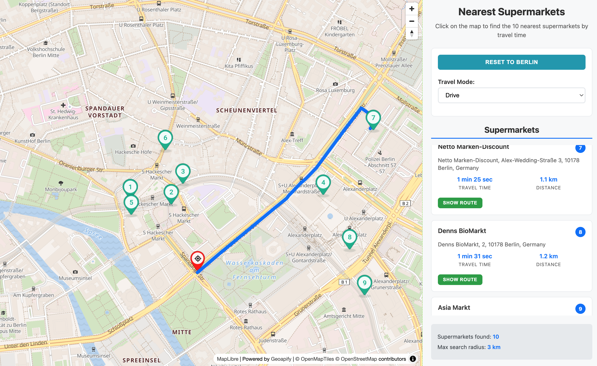

# Nearest POIs by Driving Time with Geoapify & MapLibre GL

This JavaScript sample shows how to click on any location, fetch nearby supermarkets, and rank them by **actual travel time** instead of straight-line distance. It combines the Geoapify Places, Route Matrix, and Routing APIs with a polished MapLibre GL UI so that users can explore the ten fastest supermarkets as an example of POI for any travel mode and instantly visualize routes.

## Features

- Set a user location by clicking on the map (default location - Berlin)
- Retrieve supermarkets from the [Geoapify Places API](https://www.geoapify.com/places-api/) within a configurable radius (by default is 3 km)
- Get driving time and distance from the user location for every POI using the [Geoapify Route Matrix API](https://www.geoapify.com/route-matrix-api/)
- Highlight the top 10 closest supermarkets with numbered markers and synchronized sidebar cards
- Request a detailed route for any result via the [Geoapify Routing API](https://www.geoapify.com/routing-api/) and display it on the map
- Responsive layout with loading states, error handling, and route fit-to-bounds logic



## Demo

Open the hosted version from GitHub Pages:  

[](https://geoapify.github.io/maps-api-code-samples/javascript/nearest-poi-get-places-sorted-by-driving-time/demo_combined.html)

## APIs and Libraries Used

- [Geoapify Places API](https://www.geoapify.com/places-api/) – finds supermarkets around the clicked point
- [Geoapify Map Marker API](https://www.geoapify.com/map-marker-icon-api/) – generates the custom numbered markers displayed on the map
- [Geoapify Route Matrix API](https://www.geoapify.com/route-matrix-api/) – calculates travel time and distance for multiple destinations and modes
- [Geoapify Routing API](https://www.geoapify.com/routing-api/) – returns a complete itinerary to a selected supermarket
- [MapLibre GL JS](https://maplibre.org/) – renders the interactive basemap, markers, and routes
- [inline-source](https://www.npmjs.com/package/inline-source) – flattens the demo into a single HTML file for easy hosting

## How to Run the Sample Locally

You can develop from the `src` folder or host a combined HTML build.

### Option 1: Run Locally with a Static Server

1. Install a lightweight server (once):
   ```bash
   npm install -g http-server
   ```
2. Serve the `src` folder:
   ```bash
   cd javascript/nearest-poi-get-places-sorted-by-driving-time/src
   http-server .
   ```
3. Open in your browser:
   ```
   http://localhost:8080/demo.html
   ```

### Option 2: Use IDE Live Preview

- **VS Code:** Install *Live Server* → right-click `demo.html` → “Open with Live Server”
- **WebStorm / IntelliJ:** Right-click `demo.html` → “Open in Browser”

> Avoid opening via a `file://` path—the module-based helper imports require an HTTP server.

## How to Build `demo_combined.html`

Generate a standalone HTML file with all resources inlined (ideal for GitHub Pages or newsletters):

```bash
cd javascript
npm install inline-source
node nearest-poi-get-places-sorted-by-driving-time/combine.js
```

The script reads `src/demo.html`, inlines linked CSS/JS, and writes `demo_combined.html` to the project root.
Use `demo_combined.html` whenever you need a single drop-in file for static hosting, demos, or sharing with stakeholders who should not handle multiple assets.

## Code Highlights

### 1. Query POI with Places API (`src/helper/places-api.js`)

This helper builds a [Geoapify Places API](https://www.geoapify.com/places-api/) query that filters by the `commercial.supermarket` category, adds a `circle` filter, and biases results toward the clicked location—an SEO-friendly pattern whenever you want to highlight a specific POI vertical (cafés, EV chargers, pharmacies, etc.) in your content:

```javascript
const params = new URLSearchParams({
  categories: 'commercial.supermarket',
  filter: `circle:${location.lng},${location.lat},${radius}`,
  bias: `proximity:${location.lng},${location.lat}`,
  limit,
  apiKey: this.apiKey
});

const response = await fetch(`${this.baseUrl}?${params}`);
```

Example request URL (with placeholders filled in):

```
https://api.geoapify.com/v2/places?categories=commercial.supermarket&filter=circle:13.405,52.52,3000&bias=proximity:13.405,52.52&limit=20&apiKey=YOUR_API_KEY
```

- `categories` — selects the exact POI vertical you want to surface (great for SEO because it matches user intent); browse the full taxonomy in the [Geoapify category list](https://apidocs.geoapify.com/docs/places/#categories)
- `filter=circle:<lon>,<lat>,<radius>` — hard-limits the search area so results stay relevant to the clicked map location
- `bias=proximity:<lon>,<lat>` — orders features by proximity when multiple POIs fall inside the same circle
- `limit` — caps the number of returned features; this sample grabs more than 10 to later sort them by travel time
- `apiKey` — your Geoapify project key

Adding a filter (circle, bounding box, polygon) is recommended even if you already bias the query, because it keeps the dataset small, reduces latency, and prevents unrelated POIs from creeping into SEO-focused landing pages or demos.

The `processSupermarkets()` method then converts each GeoJSON feature into the internal structure used by the UI (id, name, formatted address, coordinates, categories, and contact info).

### 2. Get POI travel time & distance with Route Matrix (`src/helper/route-matrix-api.js`)

The sample requests more than ten supermarkets, sends them as `targets`, and lets the Route Matrix API return drive times/distances for the selected travel mode—perfect for “nearest POI by travel time” scenarios:

```javascript
const requestBody = {
  mode,
  sources: [{ location: [origin.lng, origin.lat] }],
  targets: destinations.map(dest => ({
    location: [dest.coordinates.lng, dest.coordinates.lat]
  }))
};

const response = await fetch(`${this.baseUrl}?apiKey=${this.apiKey}`, {
  method: 'POST',
  headers: { 'Content-Type': 'application/json' },
  body: JSON.stringify(requestBody)
});
```

Example request:

```
POST https://api.geoapify.com/v1/routematrix?apiKey=YOUR_API_KEY
Content-Type: application/json

{
  "mode": "drive",
  "sources": [{ "location": [13.405, 52.52] }],
  "targets": [
    { "location": [13.39, 52.515] },
    { "location": [13.42, 52.525] }
  ]
}
```

- `mode` — routing profile (walk, drive, truck, etc.), matching the user’s selection
- `sources` — origin coordinates; this sample uses the user’s location as a single source
- `targets` — list of POI coordinates returned by the Places API
- `apiKey` — Geoapify project key

`processMatrixResults()` pairs each matrix cell with the supermarket, formats seconds/meters into friendly strings, and sorts the list by ascending travel time so you can show “Top 10 POIs by travel time” in the UI.

### 3. Get route geometry with the Routing API (`src/helper/routing-api.js`)

When a user taps “Show Route,” the app calls the Routing API with waypoint coordinates and the currently selected mode to fetch the full route geometry (LineString/MultiLineString) plus travel stats:

```javascript
const params = new URLSearchParams({
  waypoints: `${origin.lat},${origin.lng}|${destination.coordinates.lat},${destination.coordinates.lng}`,
  mode,
  apiKey: this.apiKey
});

const response = await fetch(`${this.baseUrl}?${params}`);
```

Example request:

```
GET https://api.geoapify.com/v1/routing?waypoints=52.52,13.405|52.515,13.39&mode=drive&apiKey=YOUR_API_KEY
```

- `waypoints` — `lat,lon|lat,lon` pairs that describe the origin and destination (add more pairs for multi-stop routes)
- `mode` — routing profile; determines which network, speeds, and road restrictions to honor
- `apiKey` — Geoapify project key

The response is a FeatureCollection whose first feature contains:

- `geometry` — the route geometry (suitable for MapLibre, Leaflet, etc.)
- `properties.distance` — meters
- `properties.time` — seconds
- `properties.mode` and `properties.waypoints` — metadata about the request

`MapHelper.displayRoute()` takes the returned route geometry, applies mode-specific styling, and `fitToRoute()` iterates through the coordinates to compute map bounds for a polished zoom-to-route animation.

### 4. MapLibre GL methods used in the helpers

| MapLibre method | What it does for this sample |
| --- | --- |
| `new maplibregl.Map({ ... })` | Creates the MapLibre GL instance with the Geoapify style URL, centered on Berlin, and hosts all subsequent layers/sources. |
| `map.loadImage(url)` | Downloads the numbered marker sprites generated by the Map Marker API so they can be displayed as MapLibre icons. |
| `map.addImage(name, image)` | Registers each downloaded sprite (rank 1–10 and the user-location icon) so symbol layers can reference them. |
| `map.addSource(id, { type: 'geojson', data })` | Adds GeoJSON sources for user location, supermarkets, and routes; these sources are updated whenever new POIs or routes arrive. |
| `map.addLayer({ ... })` | Creates symbol and line layers that visualize the GeoJSON sources (ranked markers, user icon, and route line). |
| `map.setLayoutProperty()/setPaintProperty()` | Dynamically tweaks icon size/opacity or line color/width to highlight selections and switch styles per travel mode. |
| `map.fitBounds(bounds, options)` | Animates the map to show both the user marker and the selected POIs (or the entire route geometry) within the viewport. |
| `map.on('click'/'mouseenter'/'mouseleave', handler)` | Powers the interactive behavior: clicking on the map sets a new origin, while pointer events on markers trigger sidebar highlighting. |

## Summary

- Use Geoapify Places + Route Matrix to discover the closest supermarkets (or any POI category) by travel time  
- Let users switch travel modes, instantly re-ranking the results by the latest time/distance matrix  
- Render beautiful numbered markers via the Map Marker API, sync them with sidebar cards, and keep hover/click states aligned  
- Offer single-click routing with detailed stats and polished map animations so users can navigate right away

### Learn More and Build Your Own

- Explore the full [Geoapify API suite](https://www.geoapify.com/)  
- Review the [Places API docs](https://www.geoapify.com/places-api/), [Route Matrix API docs](https://www.geoapify.com/route-matrix-api/), and [Map Marker API docs](https://www.geoapify.com/map-marker-icon-api/)  
- Create your free API key at [myprojects.geoapify.com](https://myprojects.geoapify.com) and start building your “nearest POI by travel time” experience today!
