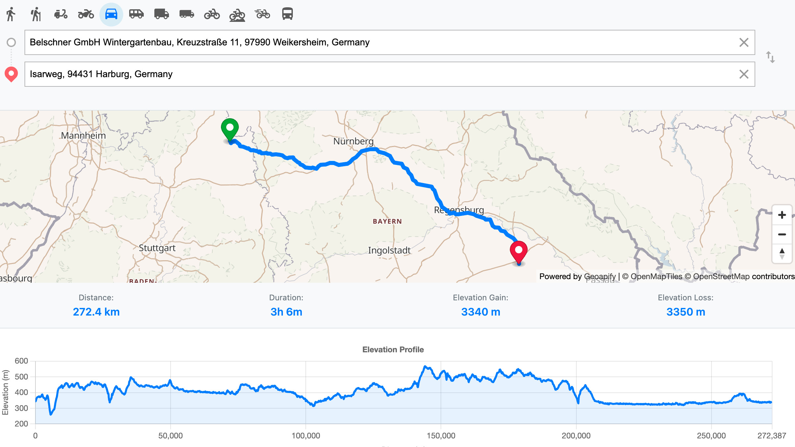

# Route Elevation Profile with MapLibre and Geoapify

This code sample demonstrates how to build an interactive route planner with elevation profile visualization using the [Geoapify Route Directions library](https://www.npmjs.com/package/@geoapify/route-directions), [Routing API](https://www.geoapify.com/routing-api/), and [MapLibre GL JS](https://maplibre.org/). It calculates a route between two points and visualizes the elevation data using [Chart.js](https://www.chartjs.org/).

Users can click on the map or search for addresses to define waypoints, select a travel mode (e.g., drive, hike, bicycle), and view:

* Interactive map with custom markers for start and end
* Turn-by-turn directions
* Distance, duration, elevation gain and loss
* Elevation profile chart



## Demo

Run the standalone demo from GitHub Pages:
**[Open Demo](https://geoapify.github.io/maps-api-code-samples/javascript/route-elevation-maplibre/demo_combined.html)**

## Features

* Click on the map or enter address to define waypoints
* Supports 12+ travel modes including walk, hike, bike, drive, bus, scooter, truck
* Visual elevation profile powered by Chart.js
* Dynamic display of distance, duration, elevation gain/loss
* MapLibre vector map with smooth animations

## APIs and Libraries Used

### [Geoapify Route Directions Library](https://www.npmjs.com/package/@geoapify/route-directions)

* UI widget for route input, travel mode, and directions
* Automatically fetches routes from Geoapify Routing API
* Supports elevation and step-by-step instructions

### [Geoapify Routing API](https://apidocs.geoapify.com/docs/routing/)

* Calculates routes between multiple waypoints
* Provides elevation, legs, distances, and steps
* Supports various travel modes and customizations

### [Chart.js](https://www.chartjs.org/)

* Renders elevation profile with smoothed area line chart
* Tooltip and axes for elevation and distance

### [MapLibre GL JS](https://maplibre.org/)

* Open-source map rendering library
* Renders vector basemaps and route overlays

## Key Files

* `src/demo.html` — Main UI layout and DOM elements
* `src/demo.js` — Initializes the map, handles clicks and routing logic
* `src/elevation.js` — Processes elevation data and builds Chart.js visualization
* `styles.css` — Custom layout and panel styling
* `combine.js` — Script to inline JS/CSS into single HTML
* `demo_combined.html` — Single-file version for deployment or sharing

## How to Run the Sample

You can run the demo locally or deploy it using GitHub Pages.

### Option 1: Run Locally with Static Server

1. **Install `http-server`** (if not installed globally):

```bash
npm install -g http-server
```

2. **Start the server** from the `src` folder:

```bash
http-server ./src
```

3. **Open the app** in your browser:

```
http://localhost:8080/demo.html
```

### Option 2: Use IDE Live Preview

If you use VS Code, WebStorm, or another IDE with live server support:

* **VS Code:** Install "Live Server" extension → Right-click `demo.html` → "Open with Live Server"
* **WebStorm / IntelliJ:** Right-click file → "Open in browser"

> Do not open via `file://` path as it blocks dynamic imports and module loading.

## How to Build `demo_combined.html`

To create a standalone HTML file (ideal for GitHub Pages or email demos):

1. **Navigate to the root folder** (e.g., `javascript/route-elevation-maplibre/`):

```bash
cd javascript
```

2. **Install `inline-source`** (once):

```bash
npm install inline-source
```

3. **Run the combine script:**

```bash
node route-elevation-maplibre/combine.js
```

This will create a `demo_combined.html` with all scripts and styles inlined.

## Code Highlights

### 1. Adding Route Directions Panel and Connecting It to the Map

This part of the code integrates the **Geoapify Route Directions UI component** into your page and connects it to the routing logic. It allows users to enter addresses manually or by clicking on the map, select travel modes, and receive real-time route calculation with elevation data.

#### HTML

The panel is defined in the HTML layout as follows:

```html
<div class="controls">
  <div class="control-header">
    <div id="route-directions"></div>
  </div>
</div>
```

This placeholder will be used to inject the route directions UI dynamically.

#### JavaScript Initialization

```js
const routeDirections = new directions.RouteDirections(
  document.getElementById("route-directions"),
  apiKey,
  {
    supportedModes: [
      'walk', 'hike', 'scooter', 'motorcycle', 'drive',
      'light_truck', 'medium_truck', 'truck',
      'bicycle', 'mountain_bike', 'road_bike',
      'bus'
    ],
    elevation: true,       // Enables elevation info for route legs
    noStopover: true        // Simplifies UX: just start and end point
  },
  {
    placeholder: "Enter an address here or click on the map"
  }
);
```

> This creates a self-contained search and directions widget, integrated with the map and using the Geoapify Routing API under the hood.

#### Listening to Routing Events

The component exposes several useful events to hook into the UI and update the map:

```js
// When a waypoint is added or changed
routeDirections.on('waypointChanged', (waypoint, reason) => {
  const options = routeDirections.getOptions();
  currentMode = options.mode || 'drive';

  const componentWaypoints = options.waypoints.filter(w => w.lat && w.lon);
  waypoints = componentWaypoints.map(w => [w.lon, w.lat]);

  updateMarkers(); // Show markers on the map

  if (waypoints.length < 2) {
    clearRouteVisualization(); // Remove existing route from map
    resetInfoPanel();          // Show initial instructions
  }
});

// When user selects another travel mode (walk, bike, etc.)
routeDirections.on('modeChanged', (mode) => {
  currentMode = mode;
});

// When route is successfully calculated
routeDirections.on('routeCalculated', (geojson) => {
  visualizeRoute(geojson);      // Draw route on the map
  createElevationChart(geojson); // Show elevation chart
});
```

### 2. How the Route is Calculated (API Under the Hood)

The routing functionality in this example is powered by the **Geoapify Routing API**, but it is wrapped inside the [`@geoapify/route-directions`](https://www.npmjs.com/package/@geoapify/route-directions) library for convenience.

When the user selects two or more waypoints (either by clicking on the map or typing addresses), the `RouteDirections` component automatically constructs a routing request and fetches the result. You don’t have to deal with the API calls directly — unless you want to.

#### Behind the Scenes

Internally, `route-directions` sends a request like this:

```http
GET https://api.geoapify.com/v1/routing?waypoints=...
```

It includes:

* `waypoints`: a pipe-separated list of coordinates
* `mode`: the selected travel mode (e.g., `drive`, `walk`, etc.)
* `elevation=true`: to include elevation data
* `apiKey`: your Geoapify API key

#### If You Want to Call the [Routing API](https://apidocs.geoapify.com/docs/routing/) Directly

You can use plain JavaScript `fetch()` to send the request yourself. Here's an example of how to do it:

```js
fetch("https://api.geoapify.com/v1/routing?waypoints=45.924697464140365,4.772690845678881|45.39255995864667,5.465288893924139&mode=drive&details=elevation&apiKey=YOUR_API_KEY")
  .then(response => response.json())
  .then(result => console.log(result))
  .catch(error => console.log('error', error));
```

This returns a [GeoJSON](https://geojson.org/) object containing:

* The geometry of the route
* Distance and duration
* Leg-by-leg elevation profile (if `details=elevation`)
* Step-by-step instructions (if requested)

> You can then display the route using MapLibre, Leaflet, or any other map library that supports GeoJSON.

### 3. Drawing the Route on a MapLibre GL JS Map

Once the route is calculated (either by the RouteDirections library or directly via API), it is returned as a [GeoJSON](https://geojson.org/) object. To display it on the map, the app adds it as a new **GeoJSON source** and renders it with a **line layer**.

#### Step-by-Step Breakdown

##### 1. Add a GeoJSON source on map load

In the `onMapLoad()` function, the code prepares an empty GeoJSON source named `"route"`:

```js
map.addSource('route', {
    type: 'geojson',
    data: {
        type: 'FeatureCollection',
        features: []
    }
});
```

##### 2. Add a styled line layer for the route

Then it defines a `line` layer using this source:

```js
map.addLayer({
    id: 'route',
    type: 'line',
    source: 'route',
    layout: {
        'line-join': 'round',
        'line-cap': 'round'
    },
    paint: {
        'line-color': '#007bff',     // Blue color
        'line-width': 6              // 6-pixel-wide route
    }
});
```

This sets up the map to display any GeoJSON line as a bold, blue line.

##### 3. Update the source data when a route is calculated

When the `routeCalculated` event is triggered, the calculated GeoJSON is passed to the `visualizeRoute()` function. It replaces the route data and adjusts the map bounds:

```js
map.getSource('route').setData(geoJsonData); // Update with actual route

map.fitBounds(bounds, {
    padding: {
        top: 200,
        bottom: 400,
        left: 200,
        right: 200
    },
    duration: 1000
});
```

This ensures:

* The line is displayed correctly on the map
* The viewport zooms/pans to fit the entire route
* The elevation panel doesn’t cover important parts of the route

> ℹ️ The bounds are calculated from the route’s coordinates (and waypoints) using `maplibregl.LngLatBounds()`.

### 4. Adding Start and End Markers to the Map

After users define route waypoints, the app places visual markers on the map to indicate the start and end locations. This is done using MapLibre GL’s `Marker` and `Popup` components.

Here’s the full code snippet that adds the markers:

```js
// Remove previous markers
markers.forEach(marker => marker.remove());
markers = [];

// Add a marker for each waypoint
waypoints.forEach((waypoint, index) => {
    const marker = new maplibregl.Marker({
        color: index === 0 ? '#28a745' : '#dc3545' // Green for start, red for end
    })
    .setLngLat([waypoint[0], waypoint[1]]) // [longitude, latitude]
    .setPopup(new maplibregl.Popup().setHTML(`
        <div>
            <strong>${index === 0 ? 'Start' : 'End'}</strong><br>
            ${waypoint[1].toFixed(4)}, ${waypoint[0].toFixed(4)}
        </div>
    `))
    .addTo(map);

    markers.push(marker);
});
```

#### What it does:

* Clears any previously placed markers with `marker.remove()`
* Creates new markers:

  * Green (`#28a745`) for the **start**
  * Red (`#dc3545`) for the **end**
* Uses `setPopup()` to attach a label with coordinates
* Adds each marker to the map with `.addTo(map)`
* Keeps all markers in a `markers` array for future removal or updates

> This visual distinction helps users easily identify the direction of the route.

### 5. Rendering the Elevation Profile

Once a route is calculated by the RouteDirections component, you can use the `elevation_range` data (returned by Geoapify Routing API) to draw an elevation profile chart. This is done using the Chart.js library and a helper function from `elevation.js`.

Here’s how the chart is rendered:

```js
import { createElevationChart } from './elevation.js';

routeDirections.on('routeCalculated', (geojson) => {
    visualizeRoute(geojson);           // Draw the route on the map
    createElevationChart(geojson);     // Create and render the elevation chart
});
```

And the elevation rendering logic looks like this:

```js
export function createElevationChart(routeData) {
    destroyChart(); // Clear previous chart if it exists

    const feature = routeData.type === 'Feature'
        ? routeData
        : routeData.features?.[0];

    const elevationData = calculateElevationProfileData(feature);

    if (elevationData.data.length === 0) return;

    drawElevationProfile(elevationData);
    updateRouteStats(feature, elevationData);
    showElements();
}
```

#### Key Features:

* **Smooth line chart** using Chart.js with `fill`, `tooltip`, and axis labels.
* **Based on real elevation data** returned in the `elevation_range` property of each route leg.
* **Optimized rendering**: filters out minor changes to keep the chart clean and fast.

This gives users a clear and interactive view of how elevation changes along the route — perfect for hiking, biking, or any terrain-aware navigation app.

> Tip: Geoapify Routing API supports elevation for most outdoor travel modes. Make sure to enable it by setting `details: ['elevation']` in RouteDirections or appending `details=elevation` to your direct API request.


## Summary

This example demonstrates how to:

* Integrate MapLibre GL with Geoapify Routing API
* Allow users to select waypoints via map or input
* Display turn-by-turn directions and travel stats
* Visualize elevation profile with Chart.js

Ideal for outdoor routing, accessibility tools, delivery planning, and educational apps.

## Learn More

* [Geoapify Routing API](https://apidocs.geoapify.com/docs/routing/)
* [Geoapify Route Directions UI](https://www.npmjs.com/package/@geoapify/route-directions)
* [MapLibre GL JS](https://maplibre.org/)
* [Chart.js Documentation](https://www.chartjs.org/docs/)
