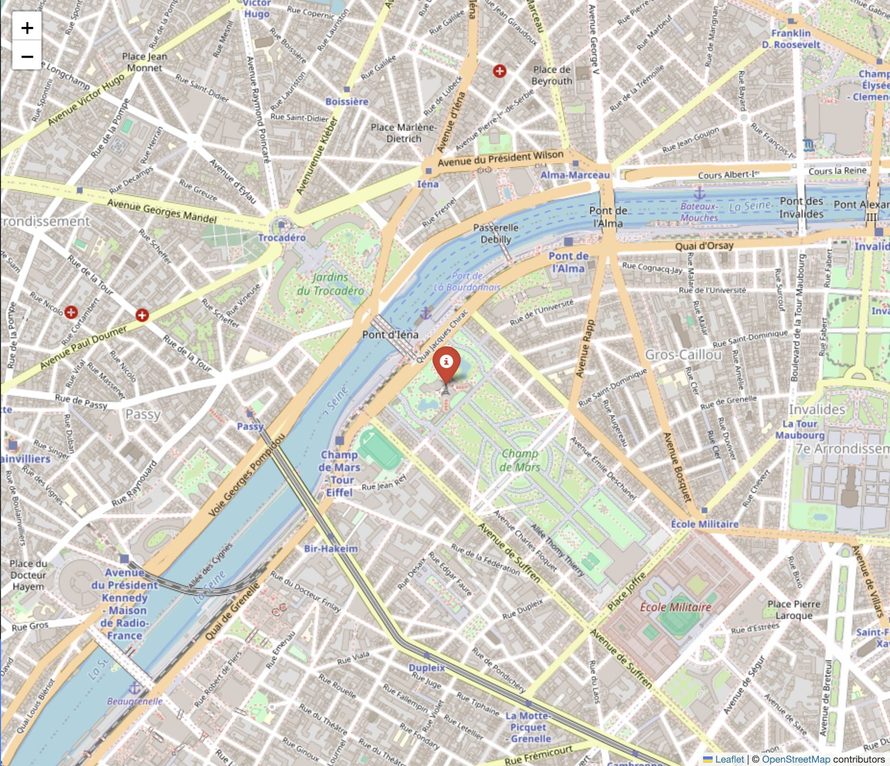

# **Creating Interactive Maps with Folium**

This project demonstrates how to create interactive maps using the Python library **Folium**. Folium is a powerful tool for building maps with markers, popups, and other interactive features.



---

## **Requirements**

Ensure you have the following installed:

1. Python 3.7 or higher
2. pip (Python package manager)

---

## **Setup Instructions**

### 1. Clone the Repository

```bash
git clone https://github.com/geoapify/maps-api-code-samples.git
cd maps-api-code-samples/python
```

### 2. Create a Virtual Environment (Optional)

It’s recommended to use a virtual environment to avoid dependency conflicts:

```bash
python -m venv env
source env/bin/activate  # On Windows: env\Scripts\activate
```

### 3. Install Folium

Install the Folium library using pip:

```bash
pip install folium
```

---

## **Running the Example**

Run the script to generate an interactive map:

```bash
python basemap-folium.py
```
This will create an HTML file named `folium_map.html`. Open it in your browser to view the map.

---
