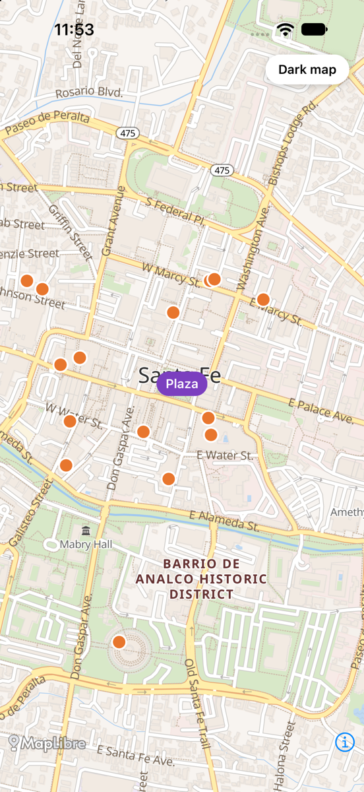

# MapLibre React Native Example: Geoapify Map Tiles in an Expo App

Show a free OpenStreetMap vector map in a React Native app with **MapLibre React Native v11** and **Geoapify map tiles**, add a marker, and load real cafés from the Geoapify Places API.

The example is an Expo app written in TypeScript. It renders a Geoapify `osm-bright` vector map centered on Santa Fe Plaza, New Mexico, switches to the `dark-matter` style with one tap, and draws up to 20 nearby cafés as circles.

## Overview

- **Stack:** Expo SDK 57, React Native 0.86 (new architecture), TypeScript, [MapLibre React Native](https://maplibre.org/maplibre-react-native/) 11.5.
- **APIs:** [Geoapify Map Tiles](https://apidocs.geoapify.com/docs/maps/map-tiles/) and [Geoapify Places API](https://apidocs.geoapify.com/docs/places/).
- **Includes:** a full-screen `Map` with a Geoapify style URL, a `Camera` with an initial view, a `Marker`, a `GeoJSONSource` with a circle `Layer` for places, and a light/dark style switch.

MapLibre React Native v11 supports only the React Native new architecture and doesn't run in **Expo Go**: it contains native code, so the app runs as a development build.

## Screenshot



## Prerequisites

- **Node.js** (LTS) and npm.
- **iOS:** macOS with the full **Xcode** app (not only the Command Line Tools; open it once to accept the license) and an iOS simulator, plus **CocoaPods**. If CocoaPods is missing, `npm run ios` tries to install it with `gem`; if that fails, install it with Homebrew: `brew install cocoapods`.
- **Android:** Android Studio with the Android SDK and an emulator, or a device with USB debugging.
- A free **Geoapify API key** (see [Geoapify API Key](#geoapify-api-key)).

**iOS 27 / Xcode 27:** iOS 27 requires the UIScene life cycle; without it the app stops at launch with a `SIGTRAP` crash. This example turns on Expo's scene support with the `expo-build-properties` plugin (`"ios": { "enableSceneSupport": true }` in `app.json`, Expo 57.0.25 or newer) until Expo SDK 58 enables it by default ([expo/expo#46664](https://github.com/expo/expo/issues/46664)).

The first native build downloads MapLibre Native and compiles the app, so it takes several minutes; later builds are faster.

## Quick Start

1. Install the dependencies:

   ```bash
   npm install
   ```

2. Create a `.env` file next to `package.json` with your Geoapify API key:

   ```bash
   cp .env.example .env
   # then edit .env: EXPO_PUBLIC_GEOAPIFY_API_KEY=your-key
   ```

3. Build and run the app on an iOS simulator or an Android emulator/device:

   ```bash
   npm run ios
   # or
   npm run android
   ```

   `expo run:ios` / `expo run:android` generate the native projects with the MapLibre config plugin and install a development build. iOS builds need Xcode on macOS; Android builds need Android Studio and the Android SDK.

## Project Structure

| File | Purpose |
|------|---------|
| `App.tsx` | The map, camera, marker, places layer and style switch |
| `app.json` | Expo configuration: the `@maplibre/maplibre-react-native` config plugin and `expo-build-properties` with iOS scene support |
| `.env.example` | Template for the `EXPO_PUBLIC_GEOAPIFY_API_KEY` variable |
| `package.json` | Dependencies and the `ios` / `android` scripts |

## Key Code Samples

### Show a Geoapify map

The `Map` component takes a style URL. Geoapify serves every map style as a `style.json`, so changing the style name changes the whole map design.

```tsx
const styleUrl = (style: string) =>
  `https://maps.geoapify.com/v1/styles/${style}/style.json?apiKey=${API_KEY}`;

<Map style={{ flex: 1 }} mapStyle={styleUrl("osm-bright")}>
  <Camera initialViewState={{ center: [-105.9384, 35.6872], zoom: 15 }} />
</Map>
```

How it works:

- `mapStyle` loads the style, which references Geoapify vector tiles, fonts and icons.
- `Camera` sets the initial center as `[longitude, latitude]` and the zoom level.
- The map attribution comes with the style and stays visible at the bottom.

### Load places from the Places API

The Places API returns a GeoJSON `FeatureCollection`, which a `GeoJSONSource` can use directly.

```tsx
fetch(
  "https://api.geoapify.com/v2/places?categories=catering.cafe" +
    "&filter=circle:-105.9384,35.6872,800&bias=proximity:-105.9384,35.6872" +
    `&limit=20&apiKey=${API_KEY}`
)
  .then(async (response) => {
    if (!response.ok) throw new Error(`Places API returned ${response.status}`);
    const data = await response.json();
    if (data?.type !== "FeatureCollection" || !Array.isArray(data.features)) {
      throw new Error("Places API returned invalid GeoJSON");
    }
    return data as GeoJSON.FeatureCollection;
  })
  .then(setCafes)
  .catch((error) => {
    console.error("Failed to load cafés:", error);
    setPlacesError(true);
  });

{cafes && (
  <GeoJSONSource id="cafes" data={cafes}>
    <Layer id="cafe-circles" type="circle" paint={{ "circle-radius": 7, "circle-color": "#e8762d" }} />
  </GeoJSONSource>
)}
```

How it works:

- `filter=circle:lon,lat,radius` limits the search to 800 m around the plaza, and `bias=proximity` sorts results by distance.
- `limit=20` keeps the request at 1 credit (every 20 places cost 1 credit).
- The app checks the HTTP response and GeoJSON shape before rendering; failures show an error message.
- The circle layer uses the `paint` prop with MapLibre style-spec names (`circle-radius`, `circle-color`), the same as in MapLibre GL JS. The older `style` prop is deprecated in v11.

## Geoapify API Key

Get a free API key at [myprojects.geoapify.com](https://myprojects.geoapify.com/). The Free plan includes 3,000 credits per day; a map tile costs 0.25 credits and 20 places cost 1 credit. An `EXPO_PUBLIC_` variable is compiled into the app bundle, so treat the key as public: use a separate key for the app and watch its usage in your Geoapify project. Geoapify key restrictions work by IP address, HTTP referrer, origin and CORS, which native apps don't send; for stricter control, call the Places API through your own backend.

## APIs and Libraries

| Name | Description | Documentation | Used In This Example |
|------|-------------|---------------|----------------------|
| Geoapify Map Tiles | Vector map styles and tiles based on OpenStreetMap | [Map tiles docs](https://apidocs.geoapify.com/docs/maps/map-tiles/) | Map styles `osm-bright` and `dark-matter` |
| Geoapify Places API | Search places by category in an area | [Places API docs](https://apidocs.geoapify.com/docs/places/) | Cafés around Santa Fe Plaza |
| MapLibre React Native | React Native map library built on MapLibre Native | [maplibre.org/maplibre-react-native](https://maplibre.org/maplibre-react-native/) | `Map`, `Camera`, `Marker`, `GeoJSONSource`, `Layer` |
| Expo | Framework and tooling for React Native apps | [docs.expo.dev](https://docs.expo.dev/) | Project setup, config plugin, development build |

## Useful Links

- [MapLibre GL JS map tiles starter for the web](https://github.com/geoapify/geoapify-quickstart-examples/tree/main/maps/maplibre-geoapify-map-tiles-starter): the same Geoapify map in a browser, no build step
- [MapLibre React Native tutorial on geoapify.com](https://www.geoapify.com/tutorial/maplibre-react-native-geoapify-map-tiles)
- [Geoapify Map Tiles](https://www.geoapify.com/map-tiles/)
- [Places API Playground](https://apidocs.geoapify.com/playground/places/)
- [MapLibre React Native v11 migration guide](https://maplibre.org/maplibre-react-native/docs/setup/migrations/v11)
